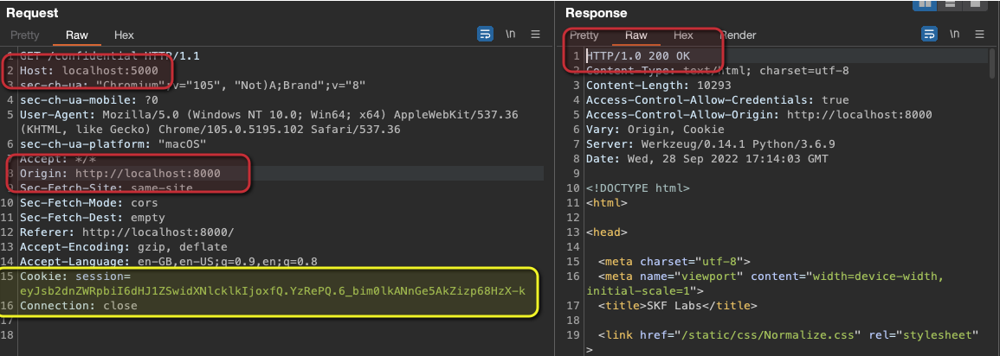
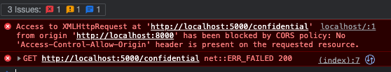

# [⬅️](./README.md) CORS - cross-origin resource sharing

## Severity:
Medium/High
## Description:
“Simple Requests“, like HTTP GET for files are always allowed cross-origin ([source](https://developer.mozilla.org/en-US/docs/Web/Security/Same-origin_policy)).
But reading actual data is not allowed; it’s blocked by SOP (Same Origin Policy)!
> Origin = protocol + domain + port 

Let’s assume a banking website, which includes data pulled by the frontend code from `bank.com`.
In this case, `api.bank.com` needs to set a CORS header telling your browser that it may render the data into the `bank.com` site and therefore relax the `Same Origin Policy`
> CORS settings are not about security, but about controlling where your resources may or may not appear.
### CORS hijacking: 
Evil webserver that will trigger the malicious XHR GET request from and display confidential data using the stored session cookie.
## Vulnerable code:
Allowing any origin to access data
```python
if __name__ == "__main__":
    cors = CORS(app, resources={r"/*": {"origins": "*"}})
    app.run(host='0.0.0.0')
```
Response headers:
```
HTTP/1.0 200 OK
Content-Type: text/html; charset=utf-8
Content-Length: 10293
Access-Control-Allow-Credentials: true
Access-Control-Allow-Origin: *
Vary: Cookie
Server: Werkzeug/0.14.1 Python/3.6.9
Date: Wed, 28 Sep 2022 14:38:06 GMT
```
## Steps to reproduce the vulnerability (CORS hijacking):
In order to to exploit this vulnerability we need to set up our evil webserver that will trigger the malicious XHR GET request from. Here is an example of a simple `index.html` template to steal confidential data using the browsers cookies:
```html
<html><body>
    <script>
      var req = new XMLHttpRequest();
      req.onload = reqListener;
      req.open('get','http://localhost:5000/confidential', true);
      req.withCredentials = true;
      req.send();
    
      function reqListener(){
        var foo = document.getElementById("stolenInfo").innerHTML= req.responseText;
        console.log(foo)
      }
    </script>
    <div id="stolenInfo"></div>
    </body></html>
```

## Remediation description:
There are a number of HTTP headers related to CORS, but the following three response headers are the most important for security:

* `Access-Control-Allow-Origin` specifies which domains can access a domain’s resources. For instance, if `requester.com` want to access `provider.com`’s resources, then developers can use this header to securely grant `requester.com` access to `provider.com`’s resources.

* `Access-Control-Allow-Credentials` specifies whether or not the browser will send cookies with the request. Cookies will only be sent if the `allow-credentials` header is set to `true`.

* `Access-Control-Allow-Methods` specifies which `HTTP` request methods (`GET`, `PUT`, `DELETE`, etc.) can be used to access resources. This header lets developers further enhance security by specifying what methods are valid when `requester.com` requests access to `provider.com`’s resources.

## Remediation code:
```python
if __name__ == "__main__":
    # Given the resource origin(method+domain+port) is indeed `http://localhost:5000`
    cors = CORS(app, resources={r"/*": {"origins": "http://localhost:5000"}})
    app.run(host='0.0.0.0')
```
