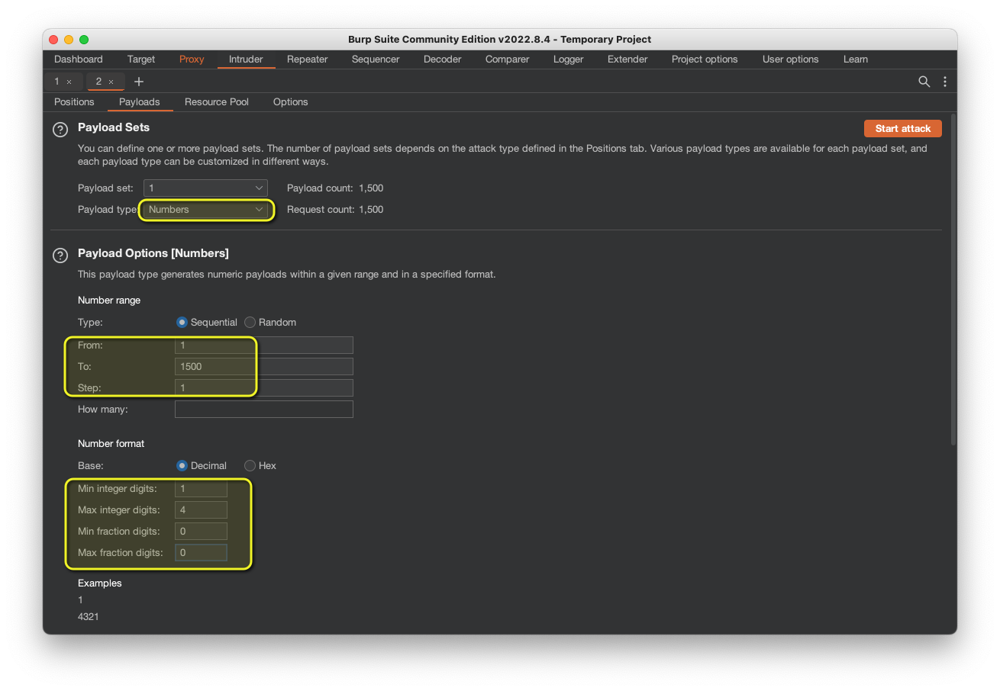

# [⬅️](./README.md) IDOR - Insecure Direct Object Reference

## Severity:
High/Critical
## Description:
When authorization mechanism is not correctly checking the user entitlements, an attacker can access resources in the system directly, for example database records or files.
```
https://bank/accounts?accNumber=3847837
https://bank/deleteAccounts?accNumber=3847837
https://bank/paySlips?userNumber=1872987
https://bank/getContract?documentID=Contract_1
```
## Vulnerable code:
Given the following webserver
```python
@app.route("/download", methods = ['POST'])
def download():
    pdf_id = request.form['pdf_id']
    if int(pdf_id) in pdf_ids:
        pdfname = str(pdf_id) + ".pdf"
        return send_from_directory(directory=".", filename= pdfname, mimetype='application/pdf')
    else:
        return render_template("index.html", result = "Pdf not found. Try with another id between 1 and 1500.")
```
And the following template:
```html
<form method="post" action="/download">
<label>Download your PDF based on ID</label> <input type="text" placeholder="pdf_id"
    name="pdf_id" class="form-control">
<button class="btn btn-primary" type="submit">Download</button>
</form>
```
## Steps to reproduce the vulnerability:
Simply submit `POST`s with values for `pdf_id` between 1 and 1500 and notice the difference in response length! (aka bruteforcing)



## Remediation description:
> * Make sure the application implements server-side authorization checks for each object request <br>
> * User/API interfaces should not refer to an internal object ID (e.g. name, file name, primary key, PII)<br>
>   * Create unique index identifiers (Hash+SALT) for each object accessible from user interface<br>
> Do not rely on security by obscurity!

* Logically Validate References (i.e. "input validation")
* Use Indirect References (i.e. mapping a UUID to the requested resource)
## Remediation code:
A very simple remediation (no code involved) would be renaming the resources with an UUID and selecting them from a secured folder. If you still "need" a code example, perhaps the [CSRF](./CSRF-cross-site-request-forgery.md) example might help you!