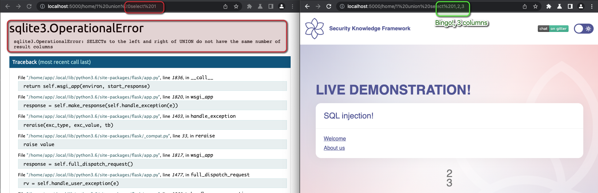
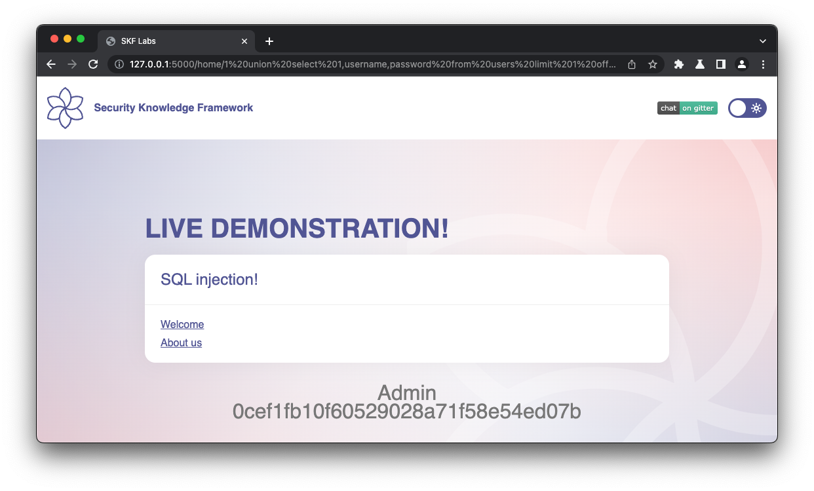

# [⬅️](./README.md) SQLi - SQL injection

## Severity:
High/Critical (if os command execution can be achieved)
## Description:
SQL Injection flaws are introduced when database queries include user supplied input.
The attacker might be able to tamper the query in a way to retrieve, modify or delete data.
### SQLi types:
* **Classic (Union-based)** - The result of UNION clause appears directly in the response
```sql
SELECT a,b FROM normal_table WHERE a = '[sqli]'
SELECT a,b FROM normal_table WHERE a = 'x' UNION SELECT c,d FROM secret_table-- '
```
* **Error-based SQL Injection** When the application shows the error message from the database, the attacker can use that to output the result of injected queries
```sql
SELECT a,b FROM table WHERE a = '[sqli]'
SELECT a,b FROM table WHERE a = '' or 1 = cast(version() as int)-- '
```
* **Blind SQL Injection** When there is no output visible, but there is the difference between failed and successful queries, which can be used to retrieve the information step-by-step.
```sql
SELECT a,b FROM table WHERE a = '[sqli]'
SELECT a,b FROM table WHERE a = '' AND substr(version(),1,1)='4' # FALSE
SELECT a,b FROM table WHERE a = '' AND substr(version(),1,1)='5' # TRUE
```
* **Time-based SQL Injection** When there is no output visible, but it’s possible to delay the query with significant timeout and use it for the query result distinction.
```sql
SELECT a,b FROM table WHERE a = '[sqli]'
SELECT a,b FROM table WHERE a = '' or 1=(CASE WHEN (1=1) THEN SLEEP(5) ELSE 0 END)--
```
## Remediation description:
* Parameterized queries
* Use implemented framework/PL instruments in favor of extra libs.
* Make use of the Least Privilege for DB user account in servers
## Vulnerable code:
```python
from config.sqlite import * 

class Pages:
    
    def getPage(self, pageId):
	    db = database_con()
	    cur = db.execute('SELECT pageId, title, content FROM pages WHERE pageId='+pageId)
	    return cur.fetchall()
```
```python
@app.route("/home/<pageId>", methods=['GET'])
def inject(pageId):
    if pageId == 0:
        pageId = 1
    sqli  = Pages()
    values = sqli.getPage(pageId)
    id      = values[0][0]
    title   = values[0][1]
    content = values[0][2]
    return render_template("index.html",title = title, content = content, id = id)
```
## Steps to reproduce the vulnerability:
Getting the number of collumns via **Error-based SQL Injection**
```
http://127.0.0.1:5000/home/1 union select 1
http://127.0.0.1:5000/home/1 union select 1,2
http://127.0.0.1:5000/home/1 union select 1,2,3
```

Exploiting the information with **Classic (Union-based)** SQLi
```
http://127.0.0.1:5000/home/1 union select 1,username,password from users limit 1 offset 0
```

## Remediation code:
Via prepared statement:
```python
def getPage(self, pageId):
    db = database_con()
    cur = db.execute('SELECT pageId, title, content FROM pages WHERE pageId= ?', (pageId))
    return cur.fetchall()
```
>Note: Stored procedures are not a defensive mechanism. They are simply another programming language that can be misused. Lets pass a procedure the following: `DROP TABLE ORDERS;`