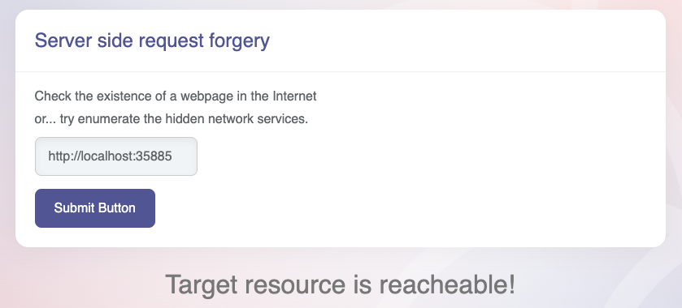

# [⬅️](./README.md) SSRF - Server Side Request Forgery

## Severity:
High/Critical (especially if OS command execution can be achieved)
## Description:
Used to fetch remote resources such as software updates, or to import data from a URL or other web applications.
> Parameter tampering, allowing an attacker to send requests on behalf of the web application server, making it to appear internal for the victim server.<br>
 
Given the following URL:
```
https:///bank/getImg?imgURL=img1.gif
```
What would happen if we would enter the following examples, instead of `img1.gif`?
```
http://localhost:22
http://localhost:23
http://localhost:1..65535
http://[INTERNAL_IP]:1..65535
file:///etc/passwd
ftp:///localhost:21
```
## Vulnerable code:
Given the following webserver:
```python
@app.route("/check_existence", methods = ['POST'])
def ssrf():
    url = request.form['url']

    if not validators.url(url) or "http" not in str(urlparse(url).scheme):
        return render_template("index.html", result = "The URL schema is not valid.")
    try:
        requests.head(url, timeout=2.000)
        return render_template("index.html", result = "Webpage found!")
    except Exception as e:
        if "NewConnectionError" in str(e):
            return render_template("index.html", result = "Target resource is not reacheable.")
        else:
            return render_template("index.html", result = "Target resource is reacheable!")
```
And the following template:
```html
<form method="post" action="/check_existence">
    <input type="text" placeholder="url" name="url" class="form-control"><br>
    <button class="btn btn-primary" type="submit">Submit Button</button>
</form>
```

## Steps to reproduce the vulnerability:
First lets see what type of services are open on the server that we try to attack, using `nmap -Pn 127.0.0.1`:
> on server, you can do `netstat -an | grep LISTEN`
```
bash-4.4$ netstat -an | grep LISTEN
tcp        0      0 0.0.0.0:35885           0.0.0.0:*               LISTEN      
tcp        0      0 0.0.0.0:45687           0.0.0.0:*               LISTEN      
tcp        0      0 0.0.0.0:44257           0.0.0.0:*               LISTEN      
tcp        0      0 0.0.0.0:38755           0.0.0.0:*               LISTEN      
tcp        0      0 0.0.0.0:5000            0.0.0.0:*               LISTEN 
```
Having the reachable ports, you can try to bruteforce them.
## Remediation description:
* **Avoid user input to make requests** on behalf of the server.
* **Create white-list** of the accepted `IP` address and `DNS` records to internal server connections
* **Do not make insecure direct** object references to system resources.
* **Disable unused URL schemas**: `ftp://`, `file://`, `dict://`, `gopher://`, etc.
* **Implement authentication** on internal services: MongoDB, Memcached, Redis, ElasticSearch, etc.

Design advice and remediation are similar to Open Redirect vulnerabilities. And the fix comes back to input validation as well. As a rule of thumb, you should avoid using user input directly in functions that can make requests on behalf of the server.

When a URL value is received by the application, it must be white-list validated against the domain of possible legitimate values and rejected if it is not a member.
## Remediation code: