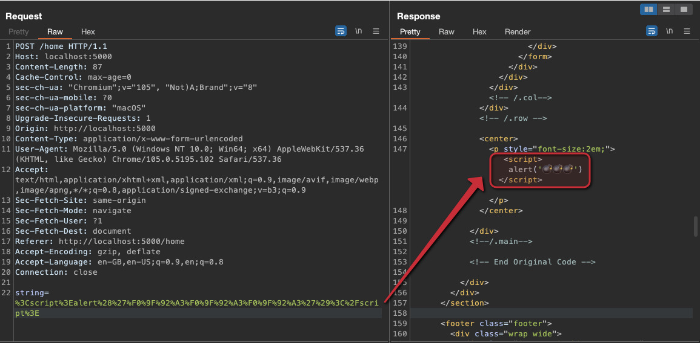

# [⬅️](./README.md) XSS (Cross Site Scripting) 

## Severity:
| XSS type   | severity |
| ---------- | -------- |
| reflected  | medium   |
| persistent | high     |
## Description:
Cross-site scripting (XSS) is a client-side code injection attack that allows an attacker to execute malicious JavaScript in another user’s browser.
### XSS types:
* Reflected XSS - Exploitable through the malicious link/form. Example: `/endpoint?param=<svg/onload=alert( 💣 )>`
* Persistent/Stored XSS - The vector is stored in DB/file/entity and can be reached directly through the app functionality. Example: `/profile?id=1337` can render XSS from the user’s bio (if XSS is stored in DB before)
## Vulnerable code:
```python
@app.route("/home", methods=['POST'])
def home():
    xss = request.form['string']
    return render_template("index.html",xss = xss)
```
```html
<center>
    <p style="font-size:2em;">
        {{xss}} 
    </p>
</center>
```
## Steps to reproduce the vulnerability:
Simply sending/storing malicios code when submiting the document. That way, the `xss`  value will be replaced with malicious JS code:

## Remediation description:
* Encoding the values
* Input validation
* Strict security headers:
  * Content Security Policy (CSP)
  * Set-Cookie HttpOnly
## Remediation code:
Via encoding:
```python
import html
@app.route("/home", methods=['POST'])
def home():
    xss = html.escape(xss)
    return render_template("index.html",xss = xss)
```
Via triggering `autoescape true` in dom
```html
<center>
    <p style="font-size:2em;">
     {{xss}}
     </p>
</center>
```
Via security headers:
```
Set-Cookie: __Host-user=admin; SameSite=Lax; Secure; Path=/; HttpOnly
```
```
Content-Security-Policy:
  script-src 'self' scripts.example.com;
  media-src 'none';
  img-src *;
  default-src 'self' http://*.example.com
```