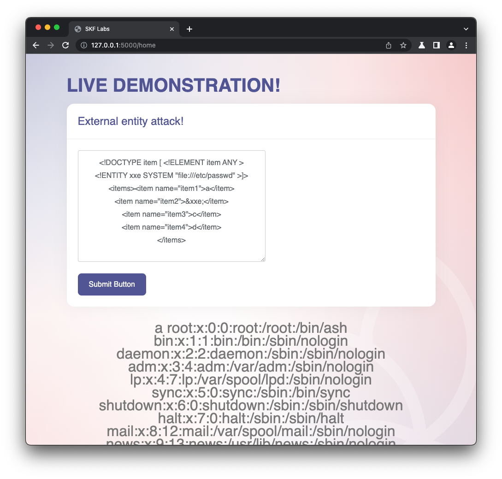
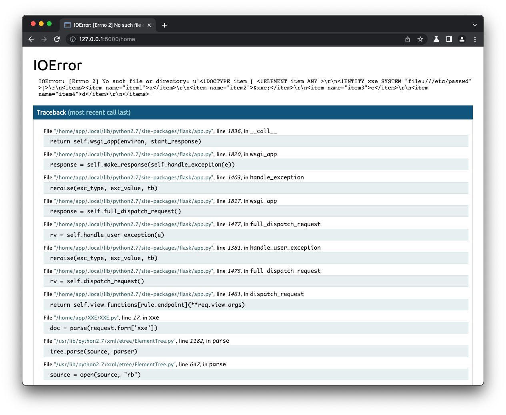

# [⬅️](./README.md) XXE - XML External Entity (injection)

## Severity:
High/Critical especially if OS command execution can be achieved
## Description:
An `XML External Entity attack` is a type of attack against an application that parses XML input. This attack occurs when **XML input containing a reference to an external entity is processed by a weakly configured XML parser**. This attack may lead to the disclosure of confidential data, denial of service, server side request forgery, port scanning from the perspective of the machine where the parser is located, and other system impacts.”
## Vulnerable code:
Given the following webserver:
```python
from xml.dom.pulldom import START_ELEMENT, parseString
import xml

@app.route("/home", methods=['POST', 'GET'])
def xxe():
    doc = parseString(request.form['xxe'])
    try:
        for event, node in doc:
            if event == START_ELEMENT and node.localName == "items":
                doc.expandNode(node)
                nodes = node.toxml()
        return render_template("index.html", nodes=nodes)
    except (UnboundLocalError, xml.sax._exceptions.SAXParseException):
        return render_template("index.html")
```
And the followint template:
```html
<form method="post" action="/home">
        <textarea id="textarea" name="xxe"></textarea>
        <button class="btn btn-primary" type="submit">Submit Button</button>
</form>
```
## Steps to reproduce the vulnerability:
Simply send the following xml:
```xml
<!DOCTYPE item [ <!ELEMENT item ANY >
<!ENTITY xxe SYSTEM "file:///etc/passwd" >]>
<items><item name="item1">a</item>
<item name="item2">&xxe;</item>
<item name="item3">c</item>
<item name="item4">d</item>
</items>
```

## Remediation description:
You need to make sure that your XML parser **no longer allows the loading of external entities** or DTD.
See [Python XML documentation](https://docs.python.org/2/library/xml.html).
## Remediation code:
To prevent XML External Entity Injection you need to include all of the following settings (Java):
```java
factory.setFeature("http://xml.org/sax/features/external-general-entities", false);
factory.setFeature("http://xml.org/sax/features/external-parameter-entities", false);
factory.setFeature("http://apache.org/xml/features/disallow-doctype-decl", true);
factory.setFeature("http://javax.xml.XMLConstants/feature/secure-processing", true);
// ( equivalent: factory.setFeature(XMLConstants.FEATURE_SECURE_PROCESSING, true);
```
For python, you can use [`DefusedXML`](https://pypi.org/project/defusedxml/):
```python
from xml.etree.ElementTree import parse
et = parse(xmlfile) # don't! ❌ ❌ ❌

from defusedxml.ElementTree import parse
et = parse(xmlfile) # better! ✅ ✅ ✅
```

