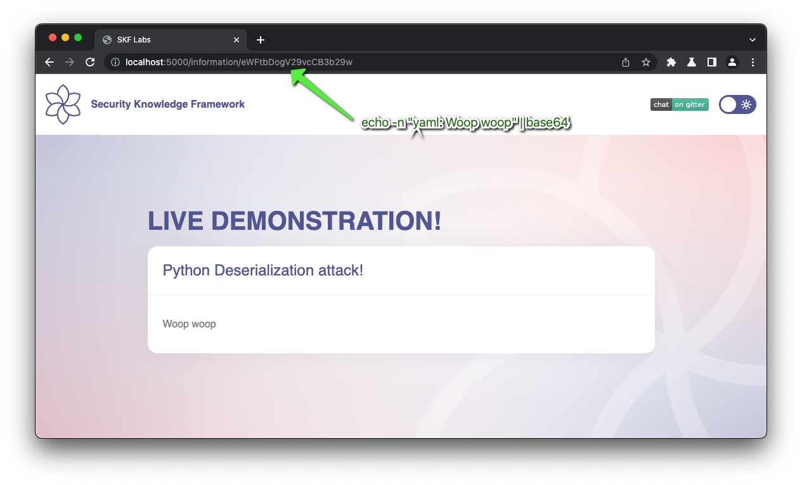
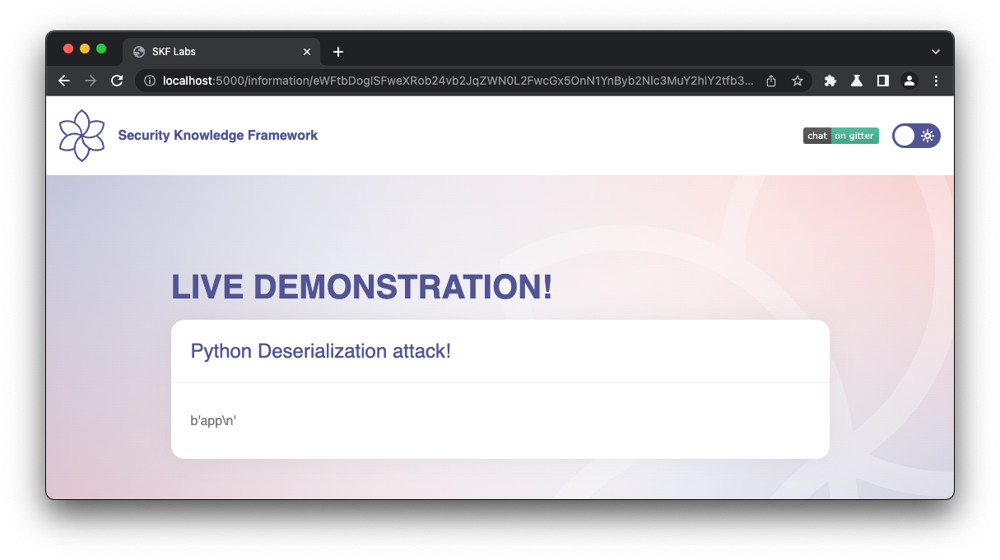

# [⬅️](./README.md) Insecure Deserialization

## Severity:
High/Critical
## Description:
Serialization refers to the process of converting an object instance or data structure into a specific format — e.g., XML or JSON — which can be saved to a file or to memory, or sent over a network.”
## Vulnerable code:
```python
@app.route("/information/<input>", methods=['GET'])
def deserialization(input):
    try:
            if not input:
                return render_template("information/index.html")
            yaml_file = base64.b64decode(input)
            content = yaml.load(yaml_file)
    except:
            content = "The application was unable to  to deserialize the object!"
    return render_template("index.html", content = content['yaml'])
```
## Steps to reproduce the vulnerability:
First we idenfitfy the webserver (python). Then we search for python deserialization libs, and we check for `YAML`.
```bash
echo -n "yaml: Woop woop" | base64z
```

Now let's try with a more dangerous `YAML`:
```yaml
yaml: !!python/object/apply:subprocess.check_output ['whoami']
```

We can see it launched the subprocess and executed the `whoami` command and displayed the outcome in the application.
## Remediation description:
* Implementing white-listing of classes allowed to deserialize objects.
* Implementing integrity checks such as digital signatures on any serialized objects to prevent hostile object creation or data tampering.
* Enforcing strict type constraints during deserialization before object creation as the code typically expects a definable set of classes.
    * Bypasses to this technique have been demonstrated, so reliance solely on this is not advisable.
* Isolating and running code that de-serializes in low privilege environments when possible.
* Log deserialization exceptions and failures, such as where the incoming type is not the expected type, or the deserialization throws exceptions.
* Restricting or monitoring incoming and outgoing network connectivity from containers or servers that de-serialize.
* Monitoring deserialization, alerting if a user de-serializes constantly
## Remediation code: 
You can check the [OWASP Insecure Deserialization CheatSheet](https://github.com/OWASP/CheatSheetSeries/blob/master/cheatsheets/Deserialization_Cheat_Sheet.md).